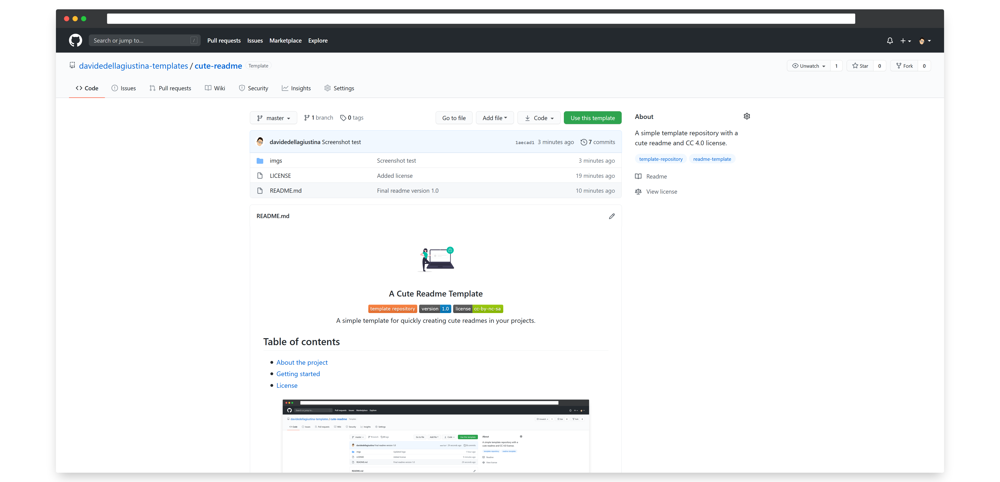

<!-- TABLE OF CONTENTS -->

Table of Contents ↗️

<!-- PROJECT LOGO -->

 

    
    <h1 align="center">A Cute Readme Template</h1>
    

        
        
        
         
        A simple template for quickly creating cute readmes in your projects.
         
    

<!-- ABOUT THE PROJECT -->

## About the project

This repository provides a simple and easy to use template including the following features:
- a cute and customizable readme;
- the `cc-by-nc-sa 4.0` license.

<!-- GETTING STARTED -->

## Getting started

In order to start using this template, just create a new repository and select this one as a template!
